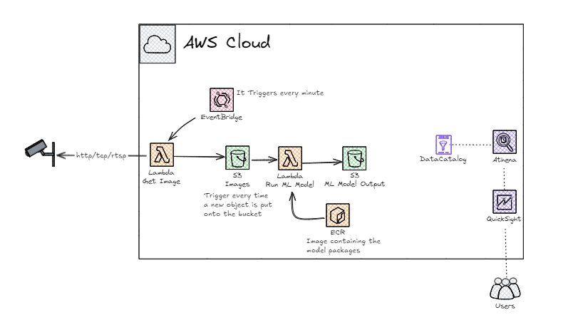

# Projeto MLModel - Predição de Best Sellers

Este projeto realiza o tratamento de dados de produtos best sellers, faz predições utilizando um modelo de machine learning e integra com AWS S3 para entrada e saída de dados. Ele está preparado para execução como AWS Lambda.

## Estrutura do Projeto

```
mlmodel/
│
├── Data/
│   └── DataTreatment.py        # Funções para tratamento dos dados
│
├── Services/
│   └── S3_service.py           # Funções para integração com AWS S3
│
├── modelo_bestseller.pkl       # Modelo treinado (pickle)
├── lambda_handler.py           # Handler principal para AWS Lambda
├── Dockerfile                  # Dockerfile para empacotamento do Lambda
```

## Funcionalidades

- **Leitura de dados JSON do S3:** Busca arquivos de entrada no S3.
- **Tratamento de dados:** Limpeza e preparação dos dados para o modelo.
- **Predição:** Utiliza um modelo scikit-learn para prever o número de avaliações dos produtos.
- **Escrita de resultados no S3:** Salva os resultados das predições em um novo arquivo JSON no S3.
- **Empacotamento para AWS Lambda:** Pronto para deploy usando container Docker.

## Principais Arquivos

### `lambda_handler.py`

- Função principal para execução no AWS Lambda.
- Busca dados no S3, carrega o modelo, executa predições e salva o resultado no S3.

### `Services/S3_service.py`

- `get_json_from_s3(bucket_name, object_key)`: Lê um arquivo JSON do S3 e retorna como dicionário Python.
- `put_json_to_s3(data)`: Salva um dicionário Python como JSON em um caminho padrão no S3.

### `Data/DataTreatment.py`

- `tratar_dados(data, model)`: Realiza o tratamento dos dados e executa a predição usando o modelo carregado.

### `modelo_bestseller.pkl`

- Modelo treinado com scikit-learn para predição.

### `Dockerfile`

- Prepara o ambiente para execução do Lambda em container, instalando dependências e copiando os arquivos necessários.

## Como Executar Localmente

1. **Instale as dependências:**
   ```
   pip install -r requirements.txt
   ```
   *(ou instale manualmente: `pip install pandas scikit-learn boto3`)*

2. **Configure suas credenciais AWS** para acesso ao S3.

3. **Execute o handler manualmente** (exemplo):
   ```python
   from lambda_handler import lambda_handler
   lambda_handler({}, None)
   ```

## Deploy no AWS Lambda

1. **Construa a imagem Docker:**
   ```
   docker build -t mlmodel-lambda .
   ```

2. **Publique a imagem em um repositório (ECR) e crie a função Lambda** conforme a [documentação oficial da AWS](https://docs.aws.amazon.com/lambda/latest/dg/images-create.html).

## Observações

- O bucket S3 padrão utilizado para saída é `fiap-mlet-fase3`.
- O modelo espera que o JSON de entrada siga o formato:
  ```json
  {
    "data": {
      "best_sellers": [
        {
          "product_price": "$19.99",
          "product_star_rating": "4.5",
          "product_num_ratings": "123",
          ...
        },
        ...
      ]
    }
  }
  ```

## Licença

Este projeto é apenas para fins educacionais.

---